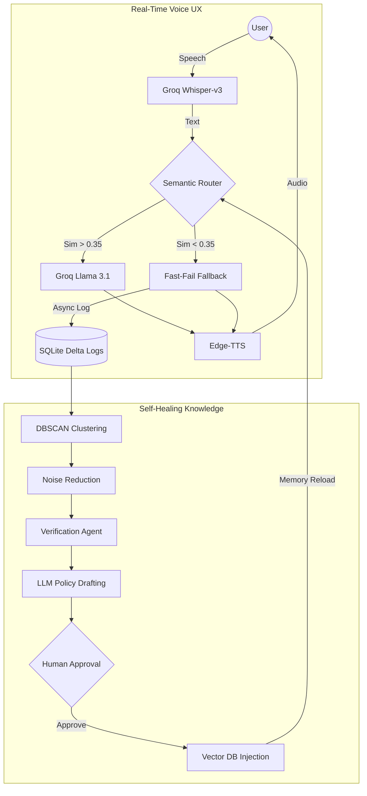

# Case Study: Engineering a Self-Healing Voice RAG Pipeline for Quick Commerce

## 🎯 Project Overview
In high-velocity Quick Commerce (e.g., Blinkit, Zepto), information is perishable. Knowledge bases often lag behind live marketing campaigns or supply chain shifts. This results in the **"Knowledge Delta"**—the gap between what a customer asks and what the AI assistant actually knows.

I designed and prototyped an ultra-low latency, **Self-Healing Voice RAG Pipeline** that not only answers customer queries but autonomously identifies knowledge gaps and proposes its own updates.

---

## 🏗️ The Architecture
The system is divided into two distinct cycles: a **High-Frequency Real-Time Loop** for user interaction and an **Offline ALOps Pipeline** for system evolution.

---

## 🚀 Key Technical Innovations

### 1. Semantic Fast-Fail (Mathematical Routing)
Voice AI is hypersensitive to latency. To achieve sub-500ms response times, I implemented a **Semantic Fast-Fail** layer.
*   **The Problem:** Querying an LLM just to have it say "I don't know" costs ~2 seconds and unnecessary tokens.
*   **The Solution:** Using a local **MiniLM-L6-v2** model, I calculate the Max Cosine Similarity of the query against the Knowledge Base. If the score is below **0.35**, the system bypasses the LLM entirely and returns a hardcoded fallback in **<30ms**.

### 2. Solving the "Delta" with DBSCAN
Logging every unknown query creates a "Noise" problem. A single user asking about "the weather" shouldn't trigger a business update.
*   **ALOps Implementation:** I built an offline script using **DBSCAN (Density-Based Spatial Clustering of Applications with Noise)**. 
*   **Impact:** Outliers (noise) are assigned label `-1` and ignored. High-density clusters (e.g., 20 users asking for "donut coupons") are identified as high-ROI knowledge gaps.

### 3. Multi-Agent Verification & HITL
To prevent **"Knowledge Poisoning"** (AI learning incorrect info from users), the system utilizes a two-stage verification:
*   **Verification Agent:** A Llama-3.1-8b instance performs a Chain-of-Thought analysis on a cluster to determine business relevance.
*   **Human-in-the-Loop (HITL):** Validated clusters generate an auto-drafted policy that requires human approval before being injected into the production **ChromaDB**.

### 4. Latency Masking (UX Optimization)
Even with Groq's high-speed LPUs, network jitter can occur. I implemented an asynchronous **Latency Masking** handler. If the API response exceeds 500ms, the system automatically plays a randomized "filler phrase" (e.g., *"Let me check that for you..."*), reducing the user's perceived latency to zero.

---

## 🛠️ Tech Stack
*   **LLM Inference:** Groq LPU (Llama 3.1 8B Instant)
*   **Speech-to-Text:** Groq Whisper-Large-V3
*   **Text-to-Speech:** Microsoft Edge-TTS (Neural)
*   **Vector Database:** ChromaDB
*   **Backend:** FastAPI (Python)
*   **Data Science:** Scikit-Learn (DBSCAN), Numpy, Scipy

---

## 🧠 Lessons in Foundation & Growth
A critical takeaway from this project was the distinction between **AI Orchestration** and **Software Engineering Fundamentals**.

During the development phase, while the high-level RAG logic was successful, I encountered a significant learning moment regarding **Asynchronous vs. Synchronous execution**. 
*   **The Realization:** In a high-concurrency Voice server, a single synchronous (blocking) call can freeze the entire application. 
*   **The Growth:** I have since focused on mastering the **Python Event Loop** and `asyncio` patterns, ensuring that every I/O-bound task (API calls, DB writes) is handled non-blockingly. This foundational shift is what moves a project from a "working script" to a "production-grade system."

---

## 📈 Scalability & Future Roadmap
The current prototype is designed for modularity. Future iterations would involve:
*   **Internal RAG Agents:** Verifying "Deltas" against internal company Slack/Notion docs instead of just drafting from scratch.
*   **WebSocket Migration:** Moving from REST to WebSockets to stream audio bytes for true real-time, "interruption-capable" conversation.
*   **Redis Caching:** Implementing semantic caching to serve common queries directly from RAM.
