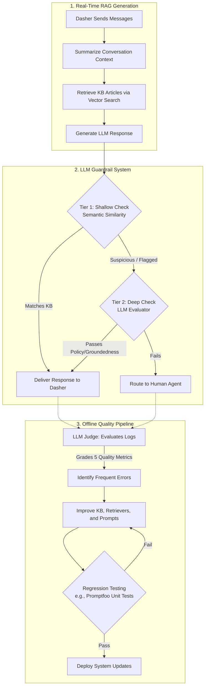

# DoorDash
[Link to article](https://careersatdoordash.com/blog/doordash-llm-chatbot-knowledge-with-ugc/#:~:text=Using%20clustering%20to%20find%20the,highest%E2%80%91impact%20gaps)

## Using clustering to find the highest‑impact gaps 

DoorDash built an automated pipeline to continuously update their customer support chatbot's Knowledge Base (KB) using User-Generated Content (UGC) from chats that had to be escalated to human agents. First, they run escalated chat transcripts through an embedding model and group them using semantic clustering to identify the most frequent missing knowledge gaps. An LLM then classifies these clusters and automatically drafts new KB articles based on how the human agents actually solved the issues. After a quick human review, the "user issue" portion of the new article is embedded into a Vector DB. In production, a Retrieval-Augmented Generation (RAG) system compares live user queries directly against these stored issue embeddings to fetch the exact solution, effectively reducing live-agent escalations by nearly half for high-traffic issues.

### The Complete End-to-End Architecture

#### Part 1: The Real-Time Voice Loop (What happens in milliseconds)
1. **User Speaks:** "Do you have donut coupons?"
2. **Delta Detection:** Vector DB returns top 5 chunks. Your `DeltaDetector` script calculates high entropy / low max-similarity. 
3. **Fast-Fail Response:** The bot instantly replies: *"I don't have info on donut coupons, but I've logged your request for our team!"*
4. **Async Logging:** In the background, you save the text `"donut coupons"` and its embedding to a Postgres/MongoDB table called `delta_logs`.

#### Part 2: The Offline "DoorDash" Loop (Overnight job)
You will build a separate script that runs as a daily CRON job (or just a script you trigger manually during the interview to show the CEO).

1. **Semantic Clustering (The Noise Filter):**
   * Fetch all embeddings from `delta_logs` over the last 24 hours.
   * Do exactly what DoorDash did: run a clustering algorithm (like DBSCAN or K-Means) with a cosine similarity threshold of `0.80`.
   * *Result:* You will see a cluster of 50 queries asking for "gold bars", a cluster of 20 queries asking for "donut coupons", and 1 random query asking "how to fix a tire".
   * *Business Impact:* You just solved the CEO's "Noise vs. Relevance" problem without blocking the voice loop! The "tire" query is ignored because it has no volume. The "gold bars" cluster is flagged as High-ROI.

2. **LLM Smart Classifier & Drafter:**
   * Pass the "Gold Bars" cluster to a heavy LLM (GPT-4) offline. 
   * *System Prompt:* "You are an AI analyzing Blinkit missing queries. Users are repeatedly asking for [Gold Bars]. Draft a temporary Knowledge Base article stating that Blinkit sells gold coins during Akshaya Tritiya, and categorize this as a 'Product Catalog' issue."

3. **The Human-in-the-Loop Dashboard (Optional for Thursday, but mention it):**
   * The drafted KB article goes to a dashboard for the Blinkit catalog team. They click "Approve".

4. **The "Secret Sauce" RAG Injection (Crucial Interview Talking Point):**
   * Mention this specific trick from the DoorDash paper: When inserting the newly approved "Gold Bars" article into the Vector DB, **only embed the user issue** (e.g., "Customer asking to buy gold bars or silver coins"). 
   * Do *not* embed the massive text of the actual policy. Why? Because comparing a user's short voice query to a short issue summary yields much higher Vector DB accuracy than comparing a short query to a 5-page document.

DoorDash transitioned from a rigid, "flow-based" chatbot to a generative RAG system to help their delivery drivers (Dashers). While RAG is much better at answering complex, multilingual questions using Knowledge Base (KB) articles, it introduced severe risks: hallucinations, bad context tracking, ignoring language instructions, and high latency. 

To solve this, DoorDash built an architecture with three major pillars:

1. **The Core RAG System:** Because users ask questions over multiple chat messages, the system first uses an LLM to summarize the entire conversation into a single core issue. It then uses this summary to search the Vector DB for relevant KB articles to generate an answer.
2. **LLM Guardrails (Real-Time Safety):** To prevent the bot from hallucinating or giving bad advice, every response is checked *before* the user sees it. Because LLM checks are slow and expensive, they built a **Two-Tier System**:
   * **Tier 1 (Shallow Check):** A fast, cheap mathematical check (sliding window semantic similarity) to see if the LLM's response actually matches the retrieved KB article. 
   * **Tier 2 (Deep Check):** If Tier 1 flags an issue, a heavy LLM evaluator steps in to check for groundedness and policy compliance. If it fails, the bot routes the user to a human agent.
3. **LLM Judge & Quality Pipeline (Offline Improvement):** DoorDash runs offline evaluations using a "Judge" LLM to grade chat logs across 5 metrics (accuracy, grammar, relevance, etc.). When they update prompts to fix these errors, they use software testing tools (like Promptfoo) to run "unit tests" on their prompts to ensure the fix didn't break something else.

---

### Mermaid Diagram of the Architecture

To safely scale their RAG-powered support chatbot for delivery drivers, DoorDash implemented a multi-layered quality control system. During live chats, generated responses must pass a fast, real-time "LLM Guardrail" system—starting with a cheap semantic similarity check, backed up by a heavier LLM evaluator—to block hallucinations and policy violations before the user sees them. Offline, DoorDash uses an "LLM Judge" to continuously grade past conversations, identify trends, and safely deploy prompt and Knowledge Base improvements using automated unit-testing tools. 

